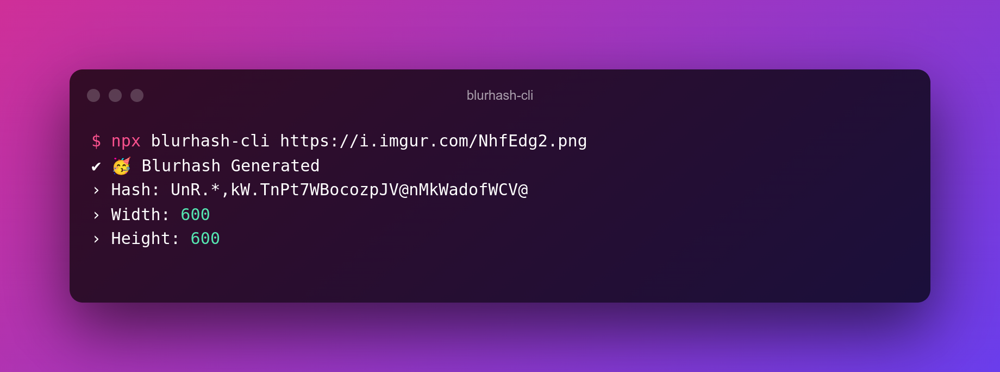

# Blurhash CLI

:unicorn: Generate blurhash without leaving your terminal.




### :package: Requirements

- Node.js 16X LTS or Higher 📦

### :sparkles: Installation

- Install the NPM Package with the below command:

```bash
#npm
npm install -g blurhash-cli

#yarn
yarn global add blurhash-cli
```

> Please note that you can also use `npx` to run the package without installing it globally.

> Example: `npx blurhash-cli`

### :bulb: Usage

In your terminal, run the below command:

```bash
npx blurhash-cli https://i.imgur.com/NhfEdg2.png
```

Modify the Size (Size is optional, it defaults to 32):

> The size flag controls the quality of the generated blurhash. A higher size value results in better quality but longer generation time.

```bash
npx blurhash-cli https://i.imgur.com/NhfEdg2.png --size=64
```

### :ballot_box_with_check: Output

```
✔ 🥳 Blurhash Generated
› Hash: UnR.*,kW.TnPt7WBocozpJV@nMkWadofWCV@
› Width: 600
› Height: 600
```

### :rocket: Example with Local Image

```bash
npx blurhash-cli ./image.png --local
```

### :six_pointed_star: Credits

- This CLI uses the [blurhash-from-url](https://www.github.com/mcnaveen/blurhash-from-url) library to generate the blurhash for the given URL.

#### :green_heart: Message

I hope you find this useful. If you have any questions, please create an issue.
